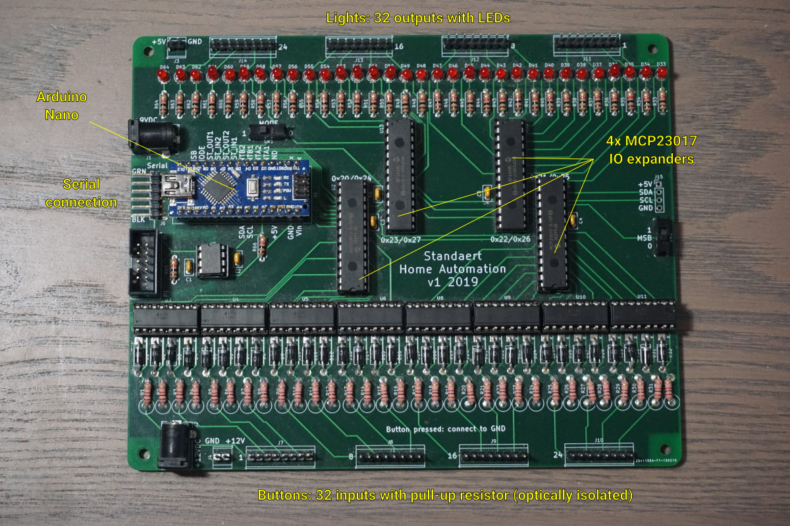

# Standaert Home Automation Controller

This repository contains the C++ code used on the Arduino Nano
that controls the home automation system at my parents' house.

The controller is placed on a board with 32 inputs and 32
outputs. It uses I²C communication with 4 MCP23017 IO expanders,
and can communicate with another system, like a Raspberry Pi,
over a serial connection. See the
[PCB repository](https://gitlab.com/RockinRoel/standaert-ha-pcb)
for more information on the board and its specifications.

This code uses [PlatformIO](https://platformio.org) and
the [Arduino](https://www.arduino.cc) framework.

## Installation instructions

[See INSTALL.md](INSTALL.md)

## Configuration

[See doc/config.md](doc/config.md)

## Serial communication

[See doc/serial.md](doc/serial.md)

## Links

- [PCB Design](https://gitlab.com/RockinRoel/standaert-ha-pcb)
- [Bridge](https://gitlab.com/RockinRoel/standaert-ha-bridge)
  (TypeScript code that bridges the serial connection of the
  Arduino Nano with Home Assistant compatible MQTT)
- [Home Assistant addon repository](https://gitlab.com/RockinRoel/standaert-ha-home-assistant-addons)

## License

The controller software is available under the terms of the
[GPLv3](https://www.gnu.org/licenses/gpl-3.0.en.html) or later
versions. See the [LICENSE](LICENSE) file.