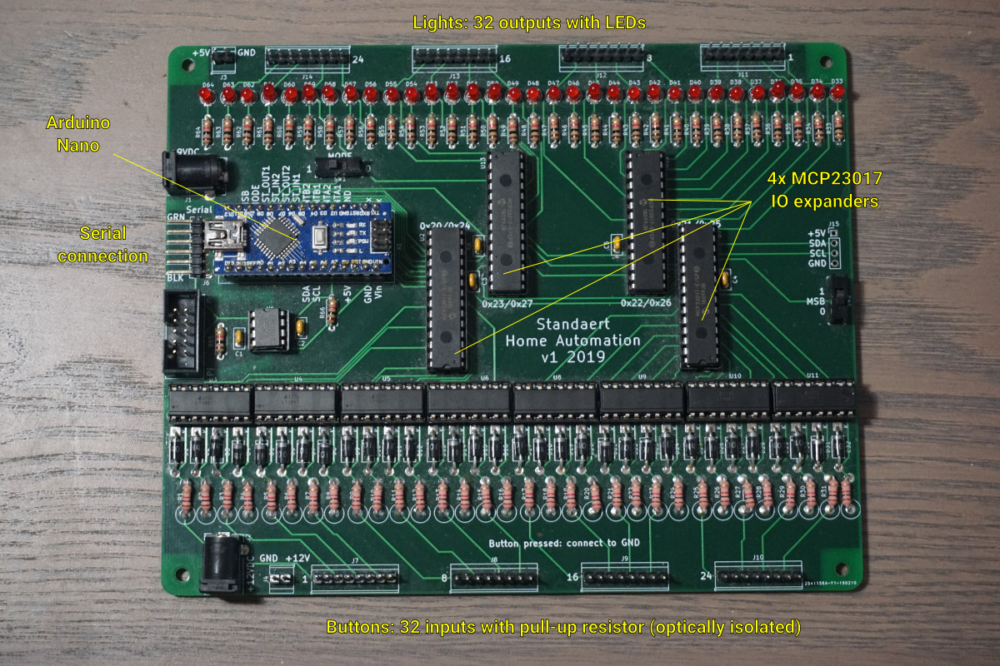

# Standaert Home Automation PCB

This repository contains the KiCAD schematic and PCB design for
the custom board used in the home automation system at my
parents' house.

## History

Since 1995 we've used a custom home automation system that my
dad made, using:

- 4 Velleman K8000 boards for I/O (32 inputs, 32 outputs)
- a Velleman K8001 control module
- 2 Velleman K6714-16 relay boards (32 relays)
- Some dimmers, infrared remote control,...
  that are no longer in use

All light switches in the house are momentary switches wired in
parallel (one wire per switch)[^1], hence the many inputs. Every
light or group of lights is controlled by a relay.

When this system failed we went through a few iterations
of protoboards with programming done using a FEZ Cobra and the
.NET Micro Framework. We used that for a while, but it was not
entirely reliable yet.

This PCB replaces the K8000 boards and the K8001 control
module with a single board with an Arduino Nano. The only part
still in place from the old system are the relay boards.

[^1]: Mostly, sometimes multiple switches with the same
function use the same wire.

## Specifications

- 4 layer PCB
- Dimensions:
  - Width: 170mm
  - Height: 137mm
- 4 M3 mounting holes:
  - Center is 5mm from the edge
  - Horizontal spacing: 160mm
  - Vertical spacing: 127mm
- 32 outputs (J11-J14) with indicator LEDs (D33-D64)
- 32 inputs (J7-J10):
  - separate power supply, several voltages work, we use 12V
  - optically isolated (8 x LTV-847, U3-U6, U8-U11)
  - with pull-up resistors (R1-R32)
  - reverse current protection diodes (D1-D32)
- 4 MCP23017 I/O expanders (U2, U7, U12, U13)
  - Addresses are 0x20 to 0x23 when MSB is 0,
    0x24 to 0x27 when MSB is 1
- TTL serial connection (J6)
  - optically isolated (CPC5001G, U1)
  - pin-compatible with many USB adapters, e.g.
    [SparkFun Serial Basic Breakout](https://www.sparkfun.com/products/14050)
- Arduino Nano controller (A1)
  - 7V-12V input voltage, we use 9V
  - Provides 5V to the top part of the board
  - MODE switch (SW1):
    - Set to 0: serial only mode: the microcontroller just sends
      events through the serial connection, and executes
      commands received through the serial connection.
    - Set to 1: program mode: the microcontroller also executes
      its built-in program. This allows it to operate standalone
      without a serial connection.
  - Note: do not use the USB connection to connect with the
    Arduino Nano when it is mounted on the board. Instead use
    the UART connection. To program the Arduino the reset button
    can be used.
- Extension possibilities:
  - Optional I2C header (J15)
  - Optional switch to determine MSB of IO expander address
    (SW2). We only use one board, so we connect MSB to 0.

## Links

- [Bill of Materials](bom.md)
- Source code:
  - [Controller](https://gitlab.com/RockinRoel/standaert-ha-controller): runs on the Arduino Nano.
    Has the ability to function standalone 
  - [Bridge](https://gitlab.com/RockinRoel/standaert-ha-bridge) (TypeScript code that bridges the serial connection of the Arduino Nano with Home Assistant compatible MQTT)
  - [Home Assistant addon repository](https://gitlab.com/RockinRoel/standaert-ha-home-assistant-addons)

## Known issues and possible future improvements

- The board uses through-hole components only. This is because
  that's what I was most familiar and most comfortable with,
  and I erred on the side of caution since this system needs
  to operate 24/7 in a real home. This greatly increases the
  footprint of the board and limits the selection of
  components, though, driving costs up.
- Header J5 (marked "Pi" on the silkscreen) was intended so
  a ribbon cable can be connected to a Raspberry Pi. The pin-out
  corresponds to pins 1-10 on a Raspberry Pi. We ordered a
  ribbon cable for this, but the plastic on the connector
  makes it so it doesn't fit on the Raspberry Pi. You would
  have to custom make a ribbon cable with 10 wires, a 40-pin
  and a 10-pin connector to make it work. We ended up just
  using J6 with a [SparkFun Serial Basic Breakout](https://www.sparkfun.com/products/14050) instead. If I am ever to
  make another revision I might just put a USB connnector and a USB-to-serial chip on the board itself.
- It may be nice to repeat the I²C header (J15) on the left so
  that two boards can be placed side by side. If there's ever
  another revision, I may just remove J5, move J6 down (or add
  a USB connector instead) and put another I²C header on the
  left. 32 inputs and 32 outputs is plenty for our use case,
  though.